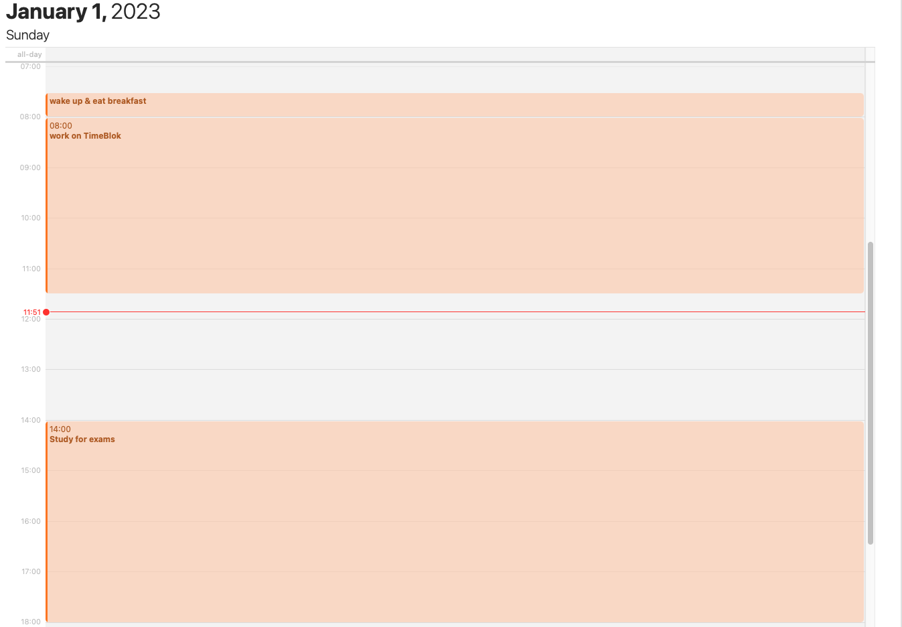
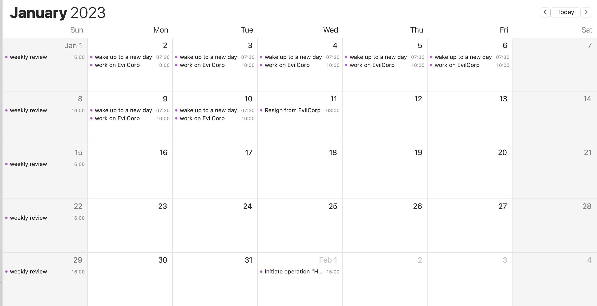

# TimeBlok


<a href="https://discord.gg/MXxsyAaeFg"></a>

```bash
cargo install timeblok  # install timeblok 
timeblok -no            # create&write a new blok file, and open it in your calendar app! 
```

## What is TimeBlok? 
TimeBlok is a simple, declarative DSL that combines the versatility and extensibility of plain text 
with the convenience of digital calendars for 
personal calendar planning. 

Inspired by Cal Newport's [Text File Time Blocking](https://www.calnewport.com/blog/2020/03/16/text-file-time-blocking/), 
TimeBlok offers a minimalistic syntax for organizing your schedule within plain text files, 
as well as the ability to compile to .ics files for use in any calendar application.

## Examples
### Daily planning
This is the simplest use case
```
2023-1-1
7:30am wake up & eat beakfast
8am~11:30 work on TimeBlok
- Write Technical Documentation
2pm~6pm Study for exams
8pm~10pm Reading
- Finish an entire book
```
When compiled into an .ics file, this could be imported into your calendar.


### Monthly planning
```
/region CN                                        // Sets the region to China
2023-1-                                           // Locks in the following events to 2023-1
{--1~--10 and CNworkday}                          // workdays from jan 1 to jan 10 in China
7:30am wake up to a new day
10am ~ 11am work on EvilCorp

{sun}
4pm weekly review                                 //weekly review every sunday

--11
8am~10am Resign from EvilCorp
- Make sure you still have access to the servers


-2-                                               // This overrides the month information from line 1.
--1
3pm~4pm Initiate operation "Hack the planet"
```

After resolving, this could be imported into your calendar:


## Installation
Currently, a [Rust](https://www.rust-lang.org/) installation
is required.

Installing from cargo:
```bash
$ cargo install timeblok
```


## Usage
Exporting to file:
```bash
$ timeblok input.txt -f output.ics
```

Exporting & opening in default calendar application:
```bash
$ timeblok input.txt -o
```

Create a new plan file and open it in your calendar app:
```bash
$ timeblok --new -o
$ timeblok -no # shorthand
```

Help:
```bash
$ timeblok --help
```

## Specs 
The TimeBlock language the following statements:
- Event
- Occasion
- Notes
- Filters
- Commands

`Occasion` is any single line that describes a point in time, usually dates in `YYYY-MM-DD` format.
It can be a date, a time, or a date and time.
Occasions will inherit the not specified fields from the closest previous occasion.
The first occasion inserted into scope will be the creation date of the target file.
E.g. If the previous occasion is `2024-3-`, then `--3` will be interpreted as `2024-3-3`.

An `Event` is a line of text that starts with an `Occasion` or `Range` and is followed by text indicating the event's name.

A `Note` just a line of text, if it occurs after an Event, it is considered a note for that event, which will correspond to the 
`DESCRIPTION` field of an ics entry.

A `Range` is simply a pair of Occasions, separated by a `~`, indicating, well, a time-range.

A `Command` is a line of text that starts with a `/` and is followed by a command name and arguments, allowing for an extra level of extensibility.

#### Filters
`Filters` are a special type of statement that can be used to filter out dates, events, numbers in a specified range.
Filters can be nested and combined to represent complex logic and recurring events.
Syntactically, they are enclosed in curly braces `{}`.

In the process of resolving, filters binds to the last specified `Occasion`, iterates through all possible values that fits the occasion, 
and selects those that fits the criteria for the filter.

For example, consider the following filter:
```
-2-
{--1~--10 and workday}
```
This filter bounds to the occasion `-2-`, in which the year of the occasion could be inherited from previous occasions(by default the creation date of the file)
, and the date is unspecified.
Thus, the filter will iterate through all possible dates in February. 
Since the two sub-filters are joined by an `and` clause, the filter will only select those dates that are both in the range `--1~--10` and are workdays.

The following filters are currently supported:
- Basic logic filters: `and`, `or`, `not`
- Range filters: filters all dates in a range, eg. `--1~--10` filters all dates with day value 1 to 10 in the inferred year and month
- Day-of-week filters: `workday`, `weekend`,  `sunday`, `monday`, `tuesday`, `wednesday`, `thursday`, `friday`, `saturday` (shorthand `mon` ~ `sun` is also supported)
- "Flexible date filters": basically a shorthand for range filters, eg. `--{1~10}` is equivalent to `--1~--10`

More filters are planned to be added in the future. (My current priority is to support region specific resolving of workdays based on [workalendar](https://github.com/workalendar/workalendar))

#### Commands (Experimental)
Format: `/command_name [arg1] [arg2] ...`

Currently, commands are statements that can make changes to the scope, or namespace, of the program, or perform arbitrary operations.
In the future, commands will also support creations of `OCCASIONS` and `EVENTS`, as well as a plugin system.

Currently available commands include:
- `/region [region_name]`: sets the region for resolving workdays based on the amazing [workalendar](https://github.com/workalendar/workalendar) project. For a reference of the names of all supported regions, see [here](https://github.com/JettChenT/workalendar-hub/tree/main/workingdays). Note: currently only [ISO 3166-1](https://en.wikipedia.org/wiki/ISO_3166-1) and [ISO 3166-2](https://en.wikipedia.org/wiki/ISO_3166-2) codes(eg. CN, US) are supported, but we will support more flexible region names in the future.
- `/set [key] [value]`: sets a name in the namespace to a value. This is useful for for creating custom filters. eg. `/set semester {-2-17~-6-30}`
- `/print [key]`: prints the value of a name in the namespace. 